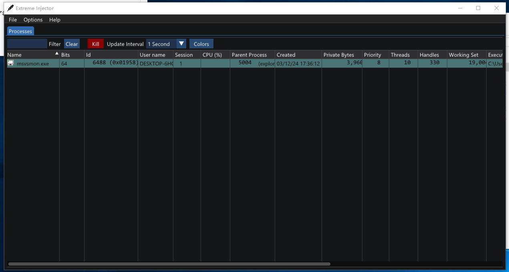
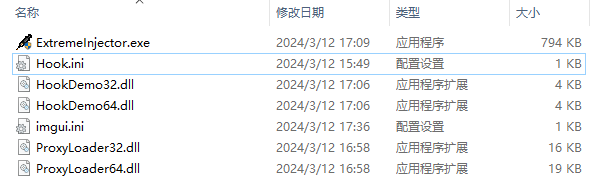
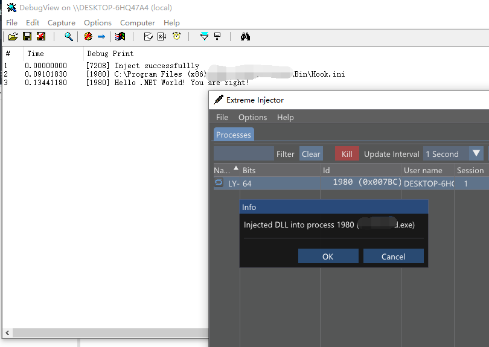

# ExtremeInjector

## Intruction

Extreme Injector is a .NET program DLL injector which is runing on Windows x64 system. Hope it useful for you :) 





## Directory Structure

The Hook.ini is a configuration file.
The HookDemoXX are just some demos.
The ProxyLoader64 and ProxyLoader32 are important for Extreme Injector. They must be placed in the same directory as the injector.
That's all.




## Usage

Put the Hook.ini in your inject target process'm path since the ProxyLoader will read the ini to load the .NET DLL. 

```
[HookInfo]
Dll=C:\Users\Test\Desktop\HookDemo64.dll
TypeName=HookDemo.Class1
Method=TestMethod
Argument=You are right!

```

The DLL is a .NET DLL that you want to inject.

The other parameters are used for `ExecuteInDefaultAppDomain` API.

```c++
HRESULT ExecuteInDefaultAppDomain (  
    [in] LPCWSTR pwzAssemblyPath,  
    [in] LPCWSTR pwzTypeName,
    [in] LPCWSTR pwzMethodName,  
    [in] LPCWSTR pwzArgument,  
    [out] DWORD *pReturnValue  
);
```


Demo Code:
```csharp
namespace HookDemo
{
    public class Class1
    {
        public static int TestMethod(string param)
        {
            Debug.WriteLine("Hello .NET World! " + param);
            return 0;
        }
    }
}

```




## Credits

- Process Explorer X by [Process Explorer X](https://github.com/zodiacon/ProcExpX)
